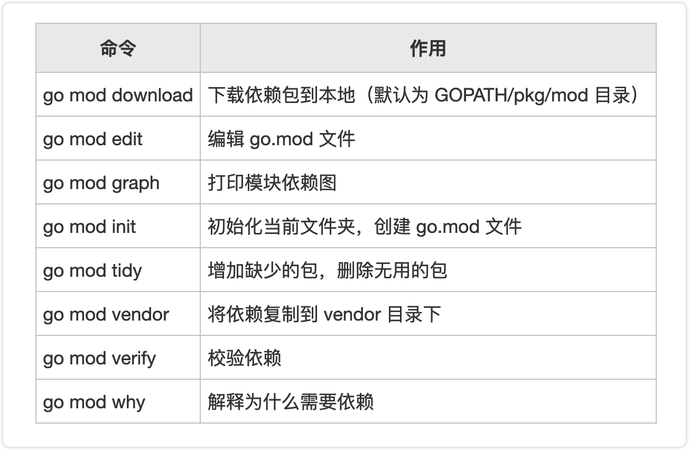
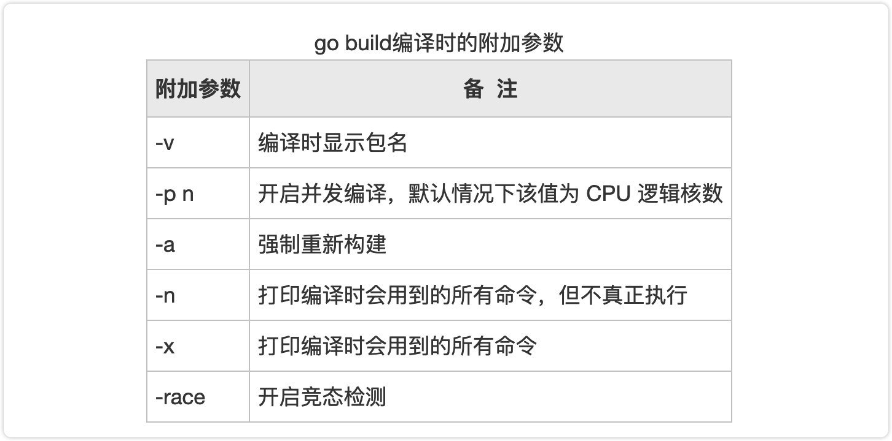

#### 使用go get命令下载指定版本的依赖包

执行`go get `命令，在下载依赖包的同时还可以指定依赖包的版本。

* 运行`go get -u`命令会将项目中的包升级到最新的次要版本或者修订版本；
* 运行`go get -u=patch`命令会将项目中的包升级到最新的修订版本；
* 运行`go get [包名]@[版本号]`命令会下载对应包的指定版本或者将对应包升级到指定的版本。

提示：`go get [包名]@[版本号]`命令中版本号可以是 x.y.z 的形式，例如 go get foo@v1.2.3，也可以是 git 上的分支或 tag，例如 go get foo@master，还可以是 git 提交时的哈希值，例如 go get foo@e3702bed2。

go.mod 文件一旦创建后，它的内容将会被 go toolchain 全面掌控，go toolchain 会在各类命令执行时，比如`go get`、`go build`、`go mod`等修改和维护 go.mod 文件。

go.mod 提供了 module、require、replace 和 exclude 四个命令：

* module 语句指定包的名字（路径）；
* require 语句指定的依赖项模块；
* replace 语句可以替换依赖项模块；
* exclude 语句可以忽略依赖项模块。

可以使用命令`go list -m -u all`来检查可以升级的 package，使用`go get -u need-upgrade-package`升级后会将新的依赖版本更新到 go.mod * 也可以使用`go get -u`升级所有依赖。

go list -m -u all 来检查可以升级的 package

go get -u 升级所有依赖

go build -race

由于某些已知的原因，并不是所有的 package 都能成功下载，比如：golang.org 下的包。

modules 可以通过在 go.mod 文件中使用 replace 指令替换成 github 上对应的库，比如：

```go
replace (
    golang.org/x/crypto v0.0.0-20190313024323-a1f597ede03a => github.com/golang/crypto v0.0.0-20190313024323-a1f597ede03a
)
```


